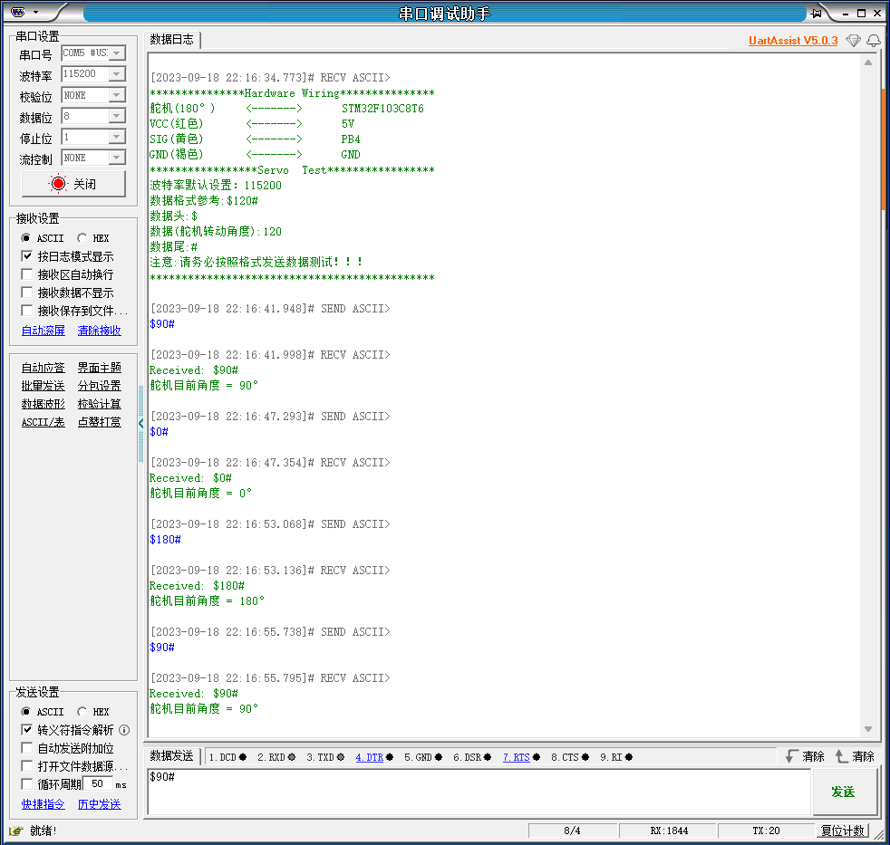

# STM32：PWM舵机控制

## 一、硬件

### 1、硬件清单

- 180°舵机
- 270°舵机
- 360°舵机
- STM32F103C8T6核心板
- 杜邦线

```
180°/270°舵机：标准舵机（角度舵机或定位舵机），可以精确控制角度位置。
```

```
360°舵机：连续旋转舵机（360°舵机或无限制舵机），可以控制舵机旋转速度和方向。
```

### 2、硬件接线

|    舵机     | STM32F103C8T6 |
| :---------: | :-----------: |
| VCC（红色） |      5V       |
|  SIG(黄色)  |      PB4      |
|  GND(褐色)  |      GND      |

## 二、标准/连续旋转舵机

PWM舵机的控制原理基于脉宽调制技术

### 1、标准舵机

- **具有固定的角度范围**
- **精确控制角度位置**

```
通过改变PWM信号来控制脉冲的高电平时间，从而来控制舵机旋转的角度
```

### 2、连续旋转舵机

- **控制旋转速度和方向**
- **实现无限制的连续旋转**

```
通过改变PWM信号来控制脉冲的高电平时间，从而来控制舵机的速度和方向
```

## 三、舵机控制思路 

控制信号以固定频率的方波形式发送给舵机；这个方波的周期通常为20ms，即50Hz的频率；

在控制信号中，脉冲的高电平时间决定舵机旋转的角度或旋转速度和方向。

| 舵机（180°） | 高电平脉宽（us） |
| :----------: | :--------------: |
|      0°      |       500        |
|     45°      |       1000       |
|     90°      |       1500       |
|     135°     |       2000       |
|     180°     |       2500       |

| 舵机（270°） | 高电平脉宽（us） |
| :----------: | :--------------: |
|      0°      |       500        |
|     135°     |       1500       |
|     270°     |       2500       |

|     舵机（360°）     | 高电平脉宽（us） |
| :------------------: | :--------------: |
| 顺时针旋转：速度最快 |       500        |
| 顺时针旋转：速度中等 |       1000       |
|       停止旋转       |       1500       |
| 逆时针旋转：速度中等 |       2000       |
| 逆时针旋转：速度最快 |       2500       |

```
表格只列举部分控制情况
```

## 四、PWM实现思路

### 1、时钟使能

```
//TIM3时钟使能
RCC_APB1PeriphClockCmd(RCC_APB1Periph_TIM3, ENABLE);
//使能GPIOB端口时钟和AFIO时钟
RCC_APB2PeriphClockCmd(RCC_APB2Periph_GPIOB | RCC_APB2Periph_AFIO, ENABLE);
```

### 2、配置GPIO为复用功能及时钟使能

```
// 配置GPIO为复用功能
GPIO_InitTypeDef GPIO_InitStructure;
GPIO_InitStructure.GPIO_Pin = GPIO_Pin_4;  // 设置要配置的引脚
GPIO_InitStructure.GPIO_Mode = GPIO_Mode_AF_PP;  // 设置引脚模式为复用推挽模式
GPIO_InitStructure.GPIO_Speed = GPIO_Speed_50MHz;  // 设置引脚的速度
GPIO_Init(GPIOB, &GPIO_InitStructure);  // 初始化GPIO配置

// 禁用JTAG 启用SWD
GPIO_PinRemapConfig(GPIO_Remap_SWJ_JTAGDisable, ENABLE);
// 把TIM3_CH1功能部分映射到PB4引脚上
GPIO_PinRemapConfig(GPIO_PartialRemap_TIM3, ENABLE);
```

```
由于使用的是PB4引脚，需要将TIM3_CH1功能部分映射到PB4引脚上
```

### 3、配置定时器3为PWM模式

```
// 配置TIM3为PWM模式
TIM_TimeBaseInitTypeDef  TIM_TimeBaseStructure;
TIM_TimeBaseStructure.TIM_Period = 20000 - 1; // PWM周期，即计数周期20ms，PWM信号频率为50HZ
TIM_TimeBaseStructure.TIM_Prescaler = 72 - 1; // 预分频系数，定时器时钟频率为72MHz/72=1MHz
TIM_TimeBaseStructure.TIM_ClockDivision = 0; // 时钟分频
TIM_TimeBaseStructure.TIM_CounterMode = TIM_CounterMode_Up; // 计数模式为向上计数
TIM_TimeBaseInit(TIM3, &TIM_TimeBaseStructure);
```

### 4、配置TIM3的通道1为PWM输出

```

// 配置TIM3的通道1为PWM输出
TIM_OCInitTypeDef  TIM_OCInitStructure;
TIM_OCInitStructure.TIM_OCMode = TIM_OCMode_PWM1; // PWM模式1
TIM_OCInitStructure.TIM_OutputState = TIM_OutputState_Enable; // 输出使能
TIM_OCInitStructure.TIM_OCPolarity = TIM_OCPolarity_High; // 输出极性为高电平
TIM_OCInitStructure.TIM_Pulse = 0; // 初始占空比
TIM_OC1Init(TIM3, &TIM_OCInitStructure);

TIM_OC1PreloadConfig(TIM3, TIM_OCPreload_Enable); // 开启OC1预加载寄存器
TIM_ARRPreloadConfig(TIM3, ENABLE);// 使能自动重装载寄存器
// 使能TIM3定时器
TIM_Cmd(TIM3, ENABLE);
```

## 五、主要函数

此处代码以180°舵机演示

### 1、main.c

```
if(Data_Flag == 1)
{
   int Servo_Degree = strtol(Data_Buffer, NULL, 10);//将数组中的数据转换成整数
   printf("%s\n",Data_Buffer);//打印数组中的字符串
   printf("舵机目前角度 = %d°\n",Servo_Degree);//打印转化后的数据
   Degree_Conv_PWM(Servo_Degree);//控制舵机旋转角度
   Data_Flag = 0;//标志位重置
   memset(Data_Buffer, 0, sizeof(Data_Buffer));//清除数组中的数据
}
```

```
使用轮询的方式判断是否接收到正确的数据，根据串口数据控制舵机运转
```

### 2、PWM.c

```
void Degree_Conv_PWM(int Servo_Degree)// 将接收的数据转换成PWM高电平脉宽
{
    float PWM_Time;
    PWM_Time = (2000.0 * (Servo_Degree / 180.0)) + 500;
    TIM_SetCompare1(TIM3, (int)PWM_Time);//定时器设置比较值函数和通道有关 时间参数单位是us
}
```

```
使用强制类型转换是为了保证精度，最后传递给定时器一个整数比较值
```

### 3、Usart.c

```
int fputc(int ch, FILE *f)// printf（）函数重定向
{
    // 发送一个字符到USART1
    USART_SendData(USART1, (uint16_t)ch);
    // 等待发送完成
    while (USART_GetFlagStatus(USART1, USART_FLAG_TXE) == RESET);
    return ch;
}

void USART1_IRQHandler(void)//串口中断函数
{
    if(USART_GetITStatus(USART1, USART_IT_RXNE) != RESET)
    {
        Rx_Buffer[Rx_Index] = USART_ReceiveData(USART1);// 从串口接收数据到缓冲区
    if(Rx_Buffer[Rx_Index] == '$')// 如果数据是以$开头则开始存储数据
    {
        memset(Rx_Buffer, 0, sizeof(Rx_Buffer));// 清空接收缓冲区
        Rx_Buffer[0] = '$';
        Rx_Index = 1;
    }
    else if(Rx_Buffer[Rx_Index] == '#' && Rx_Buffer[0] == '$')// 如果数据是以#结尾则结束数据存储并打印数据信息
    {
          printf("Received: %s\n", Rx_Buffer);// 打印接收到的数据
          memcpy(Data_Buffer, Rx_Buffer + 1, 3);// 使用memcpy函数进行数组内容复制
          memset(Rx_Buffer, 0, sizeof(Rx_Buffer));// 清空接收缓冲区
          Rx_Index = 0;// 重置索引
          Data_Flag = 1;// 数据标志位
    }
    else
    {
          Rx_Index++;// 增加索引，准备接收下一个字符
    }
    }
}
```

```
Usart1：串口中断接收以“$”开头，“#”结尾的数据
```

### 4、SysTick.c

```
void Delay_us(uint16_t us)
{
    SysTick->CTRL =  0;// SysTick控制寄存器清零，停止SysTick定时器
    SysTick->LOAD =  72*us - 1;// 设置SysTick加载寄存器的值，确定延时的时间
    SysTick->VAL =  0;// 将SysTick当前值寄存器清零
    SysTick->CTRL =  5;// 设置SysTick控制寄存器，使其开始倒数计数，并启用SysTick定时器
    while((SysTick->CTRL & 0x00010000) == 0);// 等待SysTick定时器倒数完成
    SysTick->CTRL =  0;// 再次将SysTick控制寄存器清零，停止SysTick定时器
}
```

```
使用系统滴答定时器来控制延时
```

## 六、实践

通过串口发送指令控制舵机（180°舵机演示）

### 1、UartAssist



```
注意：串口、波特率、以及数据格式等
```

### 2、现象

180°/270°舵机可以通过串口发送的指令控制舵机旋转的角度；

360°舵机可以通过串口发送的指令控制舵机旋转的方向和速度。

```
微信公众号：EESN
```
